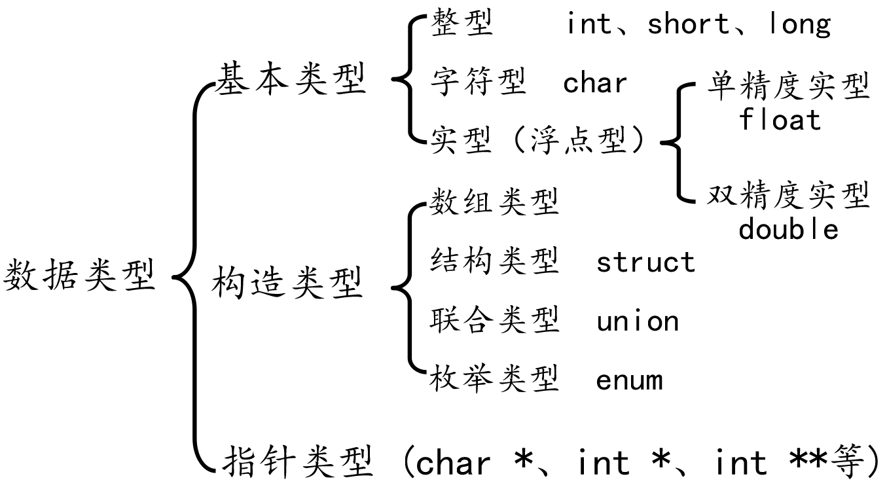

## 1 关键字

**c 的关键字共有32个**

- 数据类型关键字（12个）
```c
char, short, int, long, float, double, unsigned, signed, struct, union, enum, void
```

- 控制语句关键字（12个）
```c
if, else, switch, case, default, for, do, while, break, continue, goto, return
```

- 存储类关键字（5个）
```c
auto, extern, register, static, const
```

- 其他关键字（3个）
```c
sizeof, typedef, volatile
```

## 2 数据类型

数据类型的作用：编译器预算对象（变量）分配的内存空间大小



## 3 常量

常量：
- 在程序运行过程中，其值不能被改变的量
- 常量一般出现在表达式或赋值语句中

|整型常量|100, 200, -100, 0|
|----|----|
|实型常量|3.14, 0.125, -3.123|
|字符型常量|'a', 'b', '1', '\n'|
|字符串常量|"a", "ab", "123456"|

## 4 变量

### 1）变量

变量：
- 在程序运行过程中，其值可以改变
- 变量在使用前必须先定义，定义变量前必须有相应的数据类型

标识符命名规则：
- 标识符不能是关键字
- 标识符只能由字母、数字、下划线组成
- 第一个字符必须为字母或下划线
- 标识符中字母区分大小写

变量特点：
- 变量在编译时为其分配相应的内存空间
- 可以通过其名字和地址访问相应内存

### 2）声明和定义区别

- 声明变量不需要建立存储空间，如：`extren int a`;
- 定义变量需要建立存储空间，如：`int b`;

```c
#include <stdio.h>

int main(void)
{
    // extern 关键字只做声明
    // 声明一个变量a, a在这里没有建立存储空间
    extern int a;
    a = 10;  // err, 没有空间, 就不可以赋值

    int b = 10;  // 定义一个变量b, b的类型为int, b赋值为10

    return 0;
}
```

从广义的角度来讲声明中包含着定义，即定义是声明的一个特例，有的声明都是定义：
- `int b` 它既是声明，同时又是定义
- 对于 `extern b` 来讲它只是声明不是定义

一般的情况下，把建立存储空间的声明称之为 “定义”，而把不需要建立存储空间的声明称之为 “声明”

## 5 整型变量的定义和输出

|打印格式|含义|
|----|----|
|%d|输出一个有符号的 10 进制 int 类型|
|%o|输出 8 进制的 int 类型|
|%x|输出 16 进制的 int 类型，字母以小写输出|
|%X|输出 16 进制的 int 类型，字母以大写输出|
|%u|输出一个 10 进制的无符号数|

```c
#include <stdio.h>

int main(void)
{
    int a = 123;
    int b = 0567;
    int c = 0xabc;

    printf("a = %d\n", a);
    printf("8进制：b = %o\n", b);
    printf("10进制：b = %d\n", b);
    printf("16进制：c = %x\n", c);
    printf("16进制：c = %X\n", c);
    printf("10进制：c = %d\n", c);

    unsigned int b = 0xffffffff;
    printf("有符号方式打印：d = %d\n", d);
    printf("无符号方式打印：d = %u\n", d);

    return 0;
}
```

## 6 整型变量的输入

```c
#include <stdio.h>

int main(void)
{
    int a;
    printf("请输入a的值：");

    scanf("%d", &a);

    printf("a = %d\n", a);

    return 0;
}
```

## 7 short、int、long、long long

|数据类型|占用空间|
|----|----|
|short(短整型)|2字节|
|int(整型)|4字节|
|long(长整型)|4字节（32位）, 8字节（64位）|
|long long(长长整型)|8字节|

注意：

|整型常量|所需类型|打印格式|
|----|----|----|
|10|short 类型|%hd|
|10|代表 int 类型|%d|
|10l, 10L|代表 long int 类型|%ld|
|10ll, 10LL|代表 long long int 类型|%lld|
|10|unsigned short类型|%hd|
|10u, 10U|代表 unsigned int 类型|%u|
|10ul, 10UL|代表 unsigned long 类型|%lu|
|10ull, 10ULL|代表 unsigned long long 类型|%llu|

示例：
```c
#include <stdio.h>

int main(void)
{
    short a = 10;
    int b = 10;
    long c = 10L;
    long long d = 10LL;

    printf("sizeof(a) = %u\n", sizeof(a));
	printf("sizeof(b) = %u\n", sizeof(b));
	printf("sizeof(c) = %u\n", sizeof(c));
	printf("sizeof(c) = %u\n", sizeof(d));

	printf("short a = %hd\n", a);
	printf("int b = %d\n", b);
	printf("long c = %ld\n", c);
	printf("long long d = %lld\n", d);

	unsigned short a2 = 20u;
	unsigned int b2 = 20u;
	unsigned long c2= 20ul; 
	unsigned long long d2 = 20ull; 

	printf("unsigned short a = %hu\n", a2);
    printf("unsigned int b = %u\n", b2);
	printf("unsigned long c = %lu\n", c2);
	printf("unsigned long long d = %llu\n", d2);

    return 0;
}
```

## 8 有符号数和无符号数区别

### 1）有符号数

有符号数是最高位为符号数，0代表正数，1表示负数

```c
#include <stdio.h>

int main(void)
{
    signed a = -1089474374;  // 定义有符号整型变量 a
    printf("%X\n", a);

    return 0;
}
```

### 2）无符号数

无符号数最高位不是符号数，而就是数的一部分，无符号数不可能是负数

```c
#include <stdio.h>

int main(void)
{
    unsigned int a = 3236958922;
    printf("%X\n", a);

    return 0;
}
```

## 9 sizeof 关键字

- sizeof 不是函数，所以不需要包含任何头文件，它的功能是计算一个数据类型的大小，单位为字节
- sizeof 的返回值为 size_t
- size_t 类型在32位操作系统下是 unsigned int，是一个无符号的整数

```c
#include <stdio.h>

int main(void)
{
    int a;
    int b = sizeof(a);  // sizeof 得到指定值占用内存的大小，单位：字节

    printf("b = %d\n", b);

    size_t c = sizeof(a);
    printf("c = %u\n", c);

    return 0;
}
```

## 10 字符型：char

### 1）字符变量的定义和输出

字符型变量用于存储一个单一字符，在c语言中用char表示，其中每个字符变量都会占用1个字节。在给字符型变量赋值时，需要用一对英文半角格式的单引号 ' ' 把字符括起来。

字符变量实际上并不是把该字符本身放到变量的内存单元中去，而是将该字符对应的ASCII编码放到变量的存储单元中。char的本质就是一个1字节大小的整型。

### 2）字符变量的输入

```c
#include <stdio.h>

int main(void)
{
    char ch;
    printf("请输入ch的值：");

    scanf("%c", &ch);
    printf("ch = %c\n", ch);
    
    return 0;
}
```

### 3）ASCII对照表

|ASCII值|控制字符|ASCII值|字符|ASCII值|字符|ASCII值|字符
|----|----|----|----|----|----|----|----|
|0|NUT|32|(space)|64|@|96|、|
|1|SOH|33|!|65|A|97|a|
|2|STX|34|"|66|B|98|b|
|3|ETX|35|#|67|C|99|c|
|4|	EOT|	36|	$|	68|	D|	100|	d|
|5|	ENQ|	37|	%|	69|	E|	101|	e|
|6|	ACK|	38|	&|	70|	F|	102|	f|
|7	|BEL|	39|	,|	71|	G|	103|	g|
|8	|BS|	40|	(|	72|	H|	104|	h|
|9	|HT|	41|	)|	73|	I|	105|	i|
|10	|LF|	42|	*|	74|	J|	106|	j|
|11	|VT|	43|	+|	75|	K|	107|	k|
|12	|FF|	44|	,|	76|	L|	108|	l|
|13	|CR|	45|	-|	77|	M|	109|	m|
|14	|SO|	46|	.|	78|	N|	110|	n|
|15	|SI|	47|	/|	79|	O|	111|	o|
|16	|DLE|	48|	0|	80|	P|	112|	p|
|17	|DCI|	49|	1|	81|	Q|	113|	q|
|18	|DC2|	50|	2|	82|	R|	114|	r|
|19	|DC3|	51|	3|	83|	S|	115|	s|
|20	|DC4|	52|	4|	84|	T|	116|	t|
|21	|NAK|	53|	5|	85|	U|	117|	u|
|22	|SYN|	54|	6|	86|	V|	118|	v|
|23	|TB|	55|	7|  87|	W|	119|	w|
|24	|CAN|	56|	8|	88|	X|	120|	x|
|25	|EM|	57|	9|	89|	Y|	121|	y|
|26	|SUB|	58|	:|	90|	Z|	122|	z|
|27|	ESC|	59|	;|	91|	[|	123|	{|

ASCII码大致由以下两部分组成：
- ASCII 非打印控制字符：ASCII 表上的数字 0-31 分配给了控制字符，用于控制像打印机等一些外围设备。
- ASCII 打印字符：数字 32-126 分配给了能在键盘上找到的字符， 当查看或打印文档时就会出现。数字 127 代码 Del 命令。

### 4）转义字符

|转义字符|	含义|	ASCII码值（十进制）|
|----|----|----|
|\a|	警报|	007|
|\b|	退格(BS) ，将当前位置移到前一列|	008|
|\f|	换页(FF)，将当前位置移到下页开头|	012|
|\n|	换行(LF) ，将当前位置移到下一行开头|	010|
|\r|	回车(CR) ，将当前位置移到本行开头|	013|
|\t|	水平制表(HT) （跳到下一个TAB位置）|	009|
|\v|	垂直制表(VT)|	011|
|\\\| 代表一个反斜线字符"\" |092|
|\'|	代表一个单引号（撇号）字符|	039|
|\"|	代表一个双引号字符|	034|
|\?|	代表一个问号|	063|
|\0|	数字0|	000|
|\ddd|	8进制转义字符，d范围0~7|	3位8进制|
|\xhh|	16进制转义字符，h范围0~9，a~f，A~F|	3位16进制|

## 11 实型（浮点型）:float、double

实际变量也可以称为浮点型变量，浮点型变量是用来存储小数数值的。在c语言中，浮点型变量分为（double），但是 double 型变量所表示的浮点数比float型变量更精确。

由于浮点型变量是由有限的存储单元组成的，因此只能提供有限的有效数字。在有效位以外的数字将被舍去，这样可能会产生一些误差。

不以 f 结尾的常量数 double 类型，以 f 结尾的常量（如 3.14f）是float类型。

```c
#include <stdio.h>

int main(void)
{
    // 传统方式赋值
    float a = 3.14F;
    double b = 3.14;

    printf("a = %f\n", a);
    printf("b = %lf\n", b);

    // 科学法赋值
    a = 3.2e3f;  // 3.2 * 1000 = 320, e可以写E
    printf("a1 = %f\n", a);

    a = 100e-3f;  // 100 * 0.001 = 0.1
    printf("a2 = %f\n", a);

    a = 3.1415926f;
    printf("a3 = %f\n", a);

    return 0;
}
```

## 12 类型限定符

|限定符|含义|
|----|----|
|extern|声明一个变量，extern 声明的变量没有建立存储空间。extern int a;//变量在定义的时候创建存储空间|
|const|定义一个常量，常量的值不能修改。const int a = 10;|
|Volatile|防止编译器优化代码|
|register|定义寄存器变量，提高效率。register是建议型的指令，而不是命令型的指令，如果CPU有空闲寄存器，那么register就生效，如果没有空闲寄存器，那么register无效。|

## 13 字符串格式化和输入

### 1）字符串常量

- 字符串是内存中一段连续的 char 空间，以 '\0' (数字 0) 结尾
- 字符串常量是由双引号括起来的字符序列，如 "china"、“C program”，“$12.5”等都是合法的字符串常量

字符串常量与字符常量的不同：
每个字符串的结尾，编译器会自动的添加一个结束标志位 '\0'，即 "a" 包含两个字符 'a' 和 ’\0’。

### 2）printf 函数和 putchar函数

printf 是一个字符串，putchar 输出一个 char。

printf 格式字符：

| 打印格式 | 对应数据类型 | 含义 |
| -------- | ------------ | ---- |
|   %d       | int             | 接受整数值并将它表示为有符号的十进制整数     |
|%hd|	short int|	短整数|
|%hu	|unsigned short 	|无符号短整数|
|%o|	unsigned int|	无符号8进制整数|
|%u|	unsigned int|	无符号10进制整数|
|%x,%X|	unsigned int|	无符号16进制整数，x对应的是abcdef，X对应的是ABCDEF|
|%f|	float|	单精度浮点数|
|%lf|	double|	双精度浮点数|
|%e,%E|	double|	科学计数法表示的数，此处"e"的大小写代表在输出时用的"e"的大小写|
|%c|	char|	字符型。可以把输入的数字按照ASCII码相应转换为对应的字符|
|%s|	char * | 	字符串。输出字符串中的字符直至字符串中的空字符（字符串以'\0‘结尾，这个'\0'即空字符）|
|%p|	void *|	以16进制形式输出指针
|%%|	%|	输出一个百分号|

printf 附加格式：

|字符|含义|
|----|----|
|l(字母l)|	附加在d,u,x,o前面，表示长整数|
|-|	左对齐|
|m(代表一个整数)|	数据最小宽度|
|0(数字0)|	将输出的前面补上0直到占满指定列宽为止不可以搭配使用-|
|m.n(代表一个整数)|	m指域宽，即对应的输出项在输出设备上所占的字符数。n指精度，用于说明输出的实型数的小数位数。对数值型的来说，未指定n时，隐含的精度为n=6位。|

示例：

```c
#include <stdio.h>

int main(void)
{
    int a = 100;
    printf("a = %d\n", a);
    printf("%p\n", &a);
    printf("%%d", \n);

    char c = 'a'
    putchar(c);//putchar只有一个参数，就是要输出的char
	  long a2 = 100;
	  printf("%ld, %lx, %lo\n", a2, a2, a2);

	  long long a3 = 1000;
	  printf("%lld, %llx, %llo\n", a3, a3, a3);

	  int abc = 10;
	  printf("abc = '%6d'\n", abc);
	  printf("abc = '%-6d'\n", abc);
	  printf("abc = '%06d'\n", abc);
	  printf("abc = '%-06d'\n", abc);

	  double d = 12.3;
	  printf("d = \' %-10.3lf \'\n", d);

	  return 0;
}
```

### 3）scanf 函数与 getchar函数

- getchar是从标准输入设备读取一个char。
- scanf通过%转义的方式可以得到用户通过标准输入设备输入的数据。

```c
#include <stdio.h>

int main()
{
	  char ch1;
	  char ch2;
	  char ch3;
	  int a;
	  int b;

	  printf("请输入ch1的字符：");
	  ch1 = getchar();
	  printf("ch1 = %c\n", ch1);

	  getchar(); //测试此处getchar()的作用

	  printf("请输入ch2的字符：");
	  ch2 = getchar();
	  printf("\'ch2 = %ctest\'\n", ch2);

	  getchar(); //测试此处getchar()的作用
	  printf("请输入ch3的字符：");
    scanf("%c", &ch3);//这里第二个参数一定是变量的地址，而不是变量名
	  printf("ch3 = %c\n", ch3);

	  printf("请输入a的值：");
 	  scanf("%d", &a);
	  printf("a = %d\n", a);

	  printf("请输入b的值：");
	  scanf("%d", &b);
	  printf("b = %d\n", b);

	  return 0;
}
```

