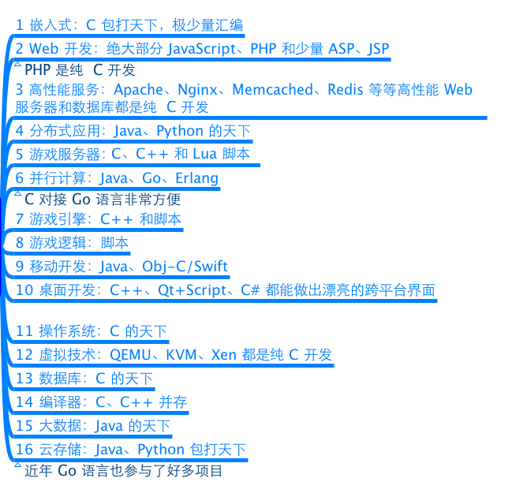
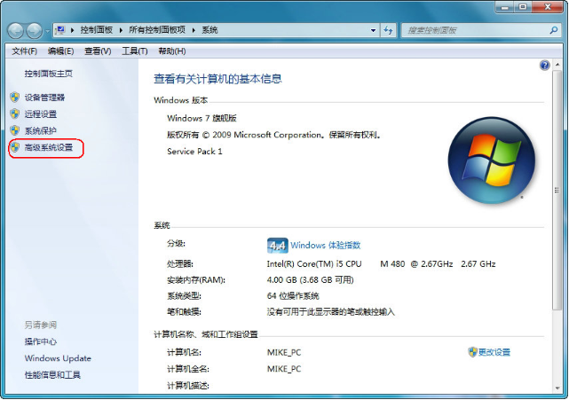
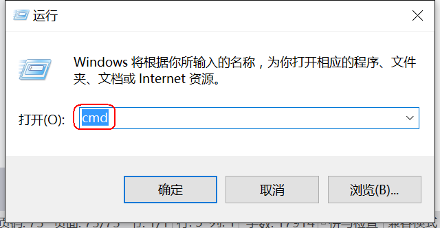
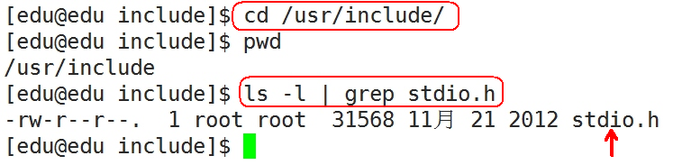

###  1.  C 语言概述

#### 1.1 什么是 C 语言

一提到语言这个词语，自然会想到的是像英语、汉语等这样的自然语言，因为它是人和人交换信息不可缺少的工具。

而今天计算机遍布了我们生活的每一个角落，除了人和人的相互交流之外，我们必须和计算机角落。

用什么的什么样的方式和计算机做最直接的交流呢？人们自然想到的是最古老也最方便的方式——语言，而  `C` 语言就是人和计算机交流的一种语言。

语言是用来交流沟通的。有一方说，有另一方听，必须有两方参与，这是语言最重要的功能：

-   说的一方传递信息，听的一方接收信息；
-   说的一方下达指令，听的一方遵循命令做事情。

语言是人和人交流，`C` 语言是人和机器交流。只是，人可以不听另外一个人，但是，计算机是无条件服从。

语言有独特的语法规则和定义，双方必须遵循这些规则和定义才能实现真正的交流。

#### 1.2 为什么要学习 C 语言

**1.2.1 C 语言特点**

1) 优点

-   代码量小
    -   <u>执行速度快</u>
    -   功能强大
    -   编程自由

2) 缺点

-   写代码实现周期长
    -   可移植性较差
    -   过于自由，经验不足易出错
    -   对平台库依赖较多

------

**1.2.2 学习 C 语言理由**


------

**1.2.3 C 语言应用领域**

`C` 语言的应用极其广泛，从网站后台，到底层操作系统，从多媒体应用到大型网络游戏，均可使用 `C` 语言来开发：

-   `C` 语言可以写网站后台程序
-   `C` 语言可以专门针对某个主题写出功能强大的程序库
-   `C` 语言可以写出大型游戏的引擎
-   `C` 语言可以写出另一个语言来
-   `C` 语言可以写操作系统和驱动程序，并且只能用 `C` 语言编写
-   任何设备只要配置了微处理器，就都支持 `C` 语言。从微波炉到手机，都是由 `C` 语言技术来推动的



------

**1.2.4 C 语言的简洁**

`C` 语言仅有 `32` 个关键字，`9` 种控制语句，`34` 种运算符，却能完成无数的功能：


------

**1.2.5 学习 C 语言的常见困惑**


#### <u>1.3 第一个C语言程序</u>

**1.3.1 编写 C 语言代码：hello.c**

```c
#include <stdio.h>

int main()

{

//这是第一个C语言代码

printf("hello world\\n");

return 0;

}
```

C 语言的源代码文件是一个普通的文本文件，但扩展名必须是 `.c`。

------

**1.3.2 通过 gcc 编译 C 代码**

1) gcc 编译器介绍

编辑器 (如 `vi`、记事本) 是指我用它来写程序的（编辑代码），而我们写的代码语句，电脑是不懂的，我们需要把它转成电脑能懂的语句，编译器就是这样的转化工具。就是说，我们用编辑器编写程序，由编译器编译后才可以运行！

编译器是将易于编写、阅读和维护的高级计算机语言翻译为计算机能解读、运行的低级机器语言的程序。

`gcc`（`GNU Compiler Collection`，`GNU` 编译器套件），是由 `GNU` 开发的编程语言编译器。`gcc `原本作为GNU操作系统的官方编译器，现已被大多数类Unix操作系统（如`Linux`、`BSD`、`Mac OS X`等）采纳为标准的编译器，`gcc` 同样适用于微软的 `Windows`。

`gcc` 最初用于编译 `C` 语言，随着项目的发展 gcc 已经成为了能够编译 `C`、`C++`、`Java`、`Ada`、`fortran`、`Object C`、`Object C++`、`Go` 语言的编译器大家族。

编译命令格式：

`gcc [-option1] ... <filename>`

`g++ [-option1] ... <filename>`

-   命令、选项和源文件之间使用空格分隔
-   一行命令中可以有零个、一个或多个选项
-   文件名可以包含文件的绝对路径，也可以使用相对路径
-   如果命令中不包含输出可执行文件的文件名，可执行文件的文件名会自动生成一个默认名，`Linux` 平台为 `a.out`，Windows平台为 `a.exe`

`gcc`、`g++` 编译常用选项说明：

| **选项**  | **含义**                   |
|-----------|----------------------------|
| -o file   | 指定生成的输出文件名为 file |
| -E        | 只进行预处理               |
| -S (大写)  | 只进行预处理和编译         |
| -c (小写)  | 只进行预处理、编译和汇编   |

2) Windows 平台下 gcc 环境配置

`windows` 命令行界面下，默认是没有 `gcc` 编译器，我们需要配置一下环境。由于我们安装了 `Qt`，`Qt`是一个集成开发环境，内部集成 `gcc` 编译器，配置一下环境变量即可使用 `gcc`。

1.  进入 Qt 安装目录：


1.  拷贝gcc所在的路径（不同安装目录有所差异）

`C:\\Qt\\Qt5.5.0\\Tools\\mingw492_32\\bin`


c) 设置 windows 环境变量

计算机（右击）－\> 属性：





如果是 `win7`，双击 `Path` 后，把拷贝的路径追加到后面，路径之间需要英文 ` ;` 分隔：


如果是 `win10`，界面做得友好一下，新建添加路径即可：


d)测试 gcc 命令：




3) Windows 平台下编译代码


------

**1.3.3 代码分析**

1) **`include` 头文件包含**

-   <u>`#include` 的意思是头文件包含，`#include <stdio.h>` 代表包含 `stdio.h` 这个头文件</u>
-   使用 C 语言库函数需要提前包含库函数对应的头文件，如这里使用了 `printf()` 函数，需要包含 `stdio.h` 头文件

`#include< >` 与 `#include " "` 的区别：

-   <u>`< >` 表示系统直接按系统指定的目录检索</u>
-   <u>`" "` 表示系统先在 `" "` 指定的路径(没写路径代表当前路径)查找头文件，如果找不到，再按系统指定的目录检索</u>

`stdio.h` 是在操作系统的系统目录下：



2) **main 函数**

-   一个完整的 C 语言程序，是由一个、且只能有一个 main()函数(又称主函数，必须有)和若干个其他函数结合而成（可选)。
-   <u>`main` 函数是 C 语言程序的入口，程序是从 `main` 函数开始执行。</u>

3) {} 括号，程序体和代码块

-   `{}` 叫代码块，一个代码块内部可以有一条或者多条语句
-   <u>C语言每句可执行代码都是 `;` 分号结尾</u>
-   <u>所有的 `#` 开头的行，都代表预编译指令，预编译指令行结尾是没有分号的</u>
-   所有的可执行语句必须是在代码块里面

4) **注释**

-   <u>`//` 叫行注释，注释的内容编译器是忽略的，注释主要的作用是在代码中加一些说明和解释，这样有利于代码的阅读</u>
-   <u>`\* */` 叫块注释</u>
-   块注释是 `C` 语言标准的注释方法
-   行注释是 从 `C++` 语言借鉴过来的

5) **printf 函数**

-   `printf` 是 `C` 语言库函数，功能是向标准输出设备输出一个字符串
-   `printf(“hello world\n”);` `\n` 的意思是回车换行

6) **return 语句**

-   <u>`return` 代表函数执行完毕，返回 `return` 代表函数的终止</u>
-   如果 `main` 定义的时候前面是 `int`，那么 `return` 后面就需要写一个整数；如果 `main` 定义的时候前面是 `void`，那么 `return` 后面什么也不需要写
-   在 `main` 函数中 `return 0` 代表程序执行成功，`return -1` 代表程序执行失败
-   `int main()` 和 `void main()` 在 `C` 语言中是一样的，但 `C++` 只接受 `int main` 这种定义方式

#### <u>1.4 system函数</u>

**1.4.1 system 函数的使用**

```c
#include <stdlib.h>

int system(const char *command);

/* 
  功能：在已经运行的程序中执行另外一个外部程序
  参数：外部可执行程序名字
  返回值：成功：0
  失败：任意数字 
*/

```

示例代码：

```c
#include <stdio.h>
#include <stdlib.h>

int main()
{

//system("calc"); windows平台

system("ls"); //Linux平台, 需要头文件 #include <stdlib.h>

return 0;

}
```

#### 1.5 C语言编译过程

**1.5.1 C程序编译步骤**

`C` 代码编译成可执行程序经过 `4` 步：

1.  预处理：宏定义展开、头文件展开、条件编译等，同时将代码中的注释删除，这里并不会检查语法
2.  编译：检查语法，将预处理后文件编译生成汇编文件
3.  汇编：将汇编文件生成目标文件 (二进制文件)
4.  链接：`C` 语言写的程序是需要依赖各种库的，所以编译之后还需要把库链接到最终的可执行程序中去


------

**1.5.2 gcc 编译过程**

1) 分步编译

预处理：`gcc -E hello.c -o hello.i`

编 译：`gcc -S hello.i -o hello.s`

汇 编：`gcc -c hello.s -o hello.o`

链 接：`gcc hello.o -o hello`

| **选项**  | **含义**                    |
| --------- | --------------------------- |
| -E        | 只进行预处理                |
| -S (大写) | 只进行预处理和编译          |
| -c (小写) | 只进行预处理、编译和汇编    |
| -o file   | 指定生成的输出文件名为 file |

| **文件后缀** | **含义**              |
|--------------|-----------------------|
| .c           | C 语言文件            |
| .i           | 预处理后的 C 语言文件 |
| .s           | 编译后的汇编文件      |
| .o           | 编译后的目标文件      |


2) 一步编译

`gcc hello.c -o demo`（还是经过：预处理、编译、汇编、链接的过程）：


------

1.5.3 查找程序所依赖的动态库

`Windows` 平台下，需要相应软件 `Depends.exe`：


#### 1.6 CPU 内部结构与寄存器(了解)

**1.6.1 64 位和32 位系统区别**

-   <u>寄存器是 `CPU` 内部最基本的存储单元</u>
-   `CPU` 对外是通过总线(地址、控制、数据)来和外部设备交互的，总线的宽度是 `8` 位，同时 `CPU` 的寄存器也是 `8` 位，那么这个 `CPU` 就叫 `8` 位 `CPU`
-   如果总线是 `32` 位，寄存器也是 `32` 位的，那么这个 `CPU` 就是 `32` 位 `CPU`
-   有一种 `CPU` 内部的寄存器是 `32` 位的，但总线是 `16` 位，准 `32` 为 `CPU`
-   所有的 `64` 位 `CPU` 兼容 `32` 位的指令，`32` 位要兼容 `16` 位的指令，所以在 `64` 位的 `CPU `上是可以识别 `32` 位的指令
-   在 `64` 位的 `CPU` 构架上运行了 `64` 位的软件操作系统，那么这个系统是 `64` 位
-   在 `64` 位的 `CPU` 构架上，运行了 `32` 位的软件操作系统，那么这个系统就是 `32` 位
-   `64` 位的软件不能运行在 `32` 位的 `CPU` 之上

------

**1.6.2 寄存器名字(了解)**

| **8位** | **16位** | **32位** | **64位** |
|---------|----------|----------|----------|
| A       | AX       | EAX      | RAX      |
| B       | BX       | EBX      | RBX      |
| C       | CX       | ECX      | RCX      |
| D       | DX       | EDX      | RDX      |

------

**1.6.3 寄存器、缓存、内存三者关系**

<u>按与 `CPU` 远近来分，离得最近的是寄存器，然后缓存 (`CPU`缓存)，最后内存。</u>

`CPU` 计算时，先预先把要用的数据从硬盘读到内存，然后再把即将要用的数据读到寄存器。于是 `CPU`<---\> 寄存器 <---\> 内存，这就是它们之间的信息交换。

那为什么有缓存呢？因为如果经常操作内存中的同一址地的数据，就会影响速度。于是就在寄存器与内存之间设置一个缓存。

因为从缓存提取的速度远高于内存。当然缓存的价格肯定远远高于内存，不然的话，机器里就没有内存的存在。

由此可以看出，从远近来看：<u>`CPU` 〈---〉寄存器〈---\> 缓存 \<---\> 内存</u>。

#### 1.7 汇编语言

1.7.1 VS 中 C 语言嵌套汇编代码(了解)

```c
#include <stdio.h>

int main()
{

    // 定义整型变量a, b, c
    int a;
    int b;
    int c;
  
    __asm{
        mov a, 3  // 3的值放在a对应内存的位置
        mov b, 4  // 4的值放在b对应内存的位置
        mov eax, a  // 把a内存的值放在eax寄存器
        add eax, b  // eax和b相加，结果放在eax
        mov c, eax  // eax的值放在c中
    }
    printf("%d\\n", c);  // 把c的值输出
  
    return 0;  // 成功完成
}
```

------

1.7.2 VS 反汇编

```c
#include <stdio.h>

int main()

{
    //定义整型变量a, b, c
    int a;
    int b;
    int c;
    a = 3;
    b = 4;
    c = a + b;
    printf("%d\\n", c);  // 把c的值输出

    return 0;  // 成功完成
}
```


1.  设置断点F9


1.  选择反汇编按钮


1.  根据汇编代码分析程序


#### 1.8 集成开发环境IDE

集成开发环境（`IDE`，`Integrated Development Environment` ）是用于提供程序开发环境的应用程序，一般包括代码编辑器、编译器、调试器和图形用户界面工具。集成了代码编写功能、分析功能、编译功能、调试功能等一体化的开发软件服务套。所有具备这一特性的软件或者软件套（组）都可以叫集成开发环境。

**1.8.1 Qt Creator**

`Qt Creator`是跨平台的 `Qt IDE`， `Qt Creator` 是 `Q`t 被 `Nokia` 收购后推出的一款新的轻量级集成开发环境（`IDE`）。此 `IDE` 能够跨平台运行，支持的系统包括 `Linux`（`32` 位及 `64` 位）、`Mac OS X` 以及 `Windows`。根据官方描述，`Qt Creator` 的设计目标是使开发人员能够利用 `Qt` 这个应用程序框架更加快速及轻易的完成开发任务。

| **快捷键**  | **含义**                   |
|-------------|----------------------------|
| Ctrl + i    | 自动格式化代码             |
| Ctrl + /    | 注释/取消注释              |
| Alt + Enter | 自动完成类函数定义         |
| F4          | .h 文件和对应.cpp 文件切换 |
| F9          | 设置断点                   |
| F5          | 调试运行                   |
| Ctrl + r    | 编译，但不调试运行         |
| Ctrl + b    | 编译，不运行               |
| F10         | next调试                   |
| F11         | step调试                   |

------

**1.8.2 Microsoft Visual Studio**

`Microsoft Visual Studio`（简称`VS`）是美国微软公司的开发工具包系列产品。`VS`是一个基本完整的开发工具集，它包括了整个软件生命周期中所需要的大部分工具，如`UML`工具、代码管控工具、集成开发环境(`IDE`)等等,所写的目标代码适用于微软支持的所有平台。`Visual Studio`是目前最流行的 `Windows` 平台应用程序的集成开发环境。

1) VS常用快捷键

| **快捷键**        | **含义**       |
|-------------------|----------------|
| Ctrl + k,Ctrl + f | 自动格式化代码 |
| Ctrl + k,Ctrl + c | 注释代码       |
| Ctrl + k,Ctrl + u | 取消注释代码   |
| F9                | 设置断点       |
| F5                | 调试运行       |
| Ctrl + F5         | 不调试运行     |
| Ctrl + Shift + b  | 编译，不运行   |
| F10               | next调试       |
| F11               | step调试       |

2) VS2013的C4996错误

由于微软在 `VS2013` 中不建议再使用 `C` 的传统库函数 `scanf`, `strcpy `, `sprintf`等，所以直接使用这些库函数会提示 `C4996` 错误：


`VS `建议采用带 `_s` 的函数，如`scanf_s`、`strcpy_s`，但这些并不是标准 `C` 函数。

要想继续使用此函数，需要在源文件中添加以下指令就可以避免这个错误提示：

`#define _CRT_SECURE_NO_WARNINGS` 这个宏定义最好要放到 `.c `文件的第一行

`#pragma warning(disable:4996)` 或者使用这个

